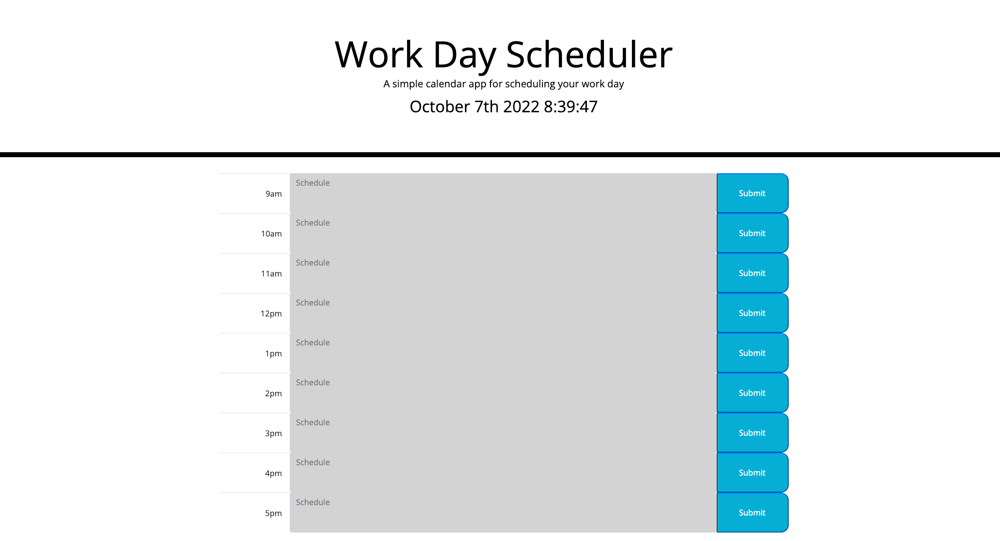

# ChallengeFive
Workday Scheduler exercise

## Description
Simple calendar application that saves schedule events per hour. A series of conditional statments and variables were made to make the code functional to meet the acceptance criteria. In the future it would be nice to figure out a way to shrink the code since so much of it is repetative. Although it works! 

## Deployed URL
https://mtbell412.github.io/ChallengeFive/

## Images of final product

